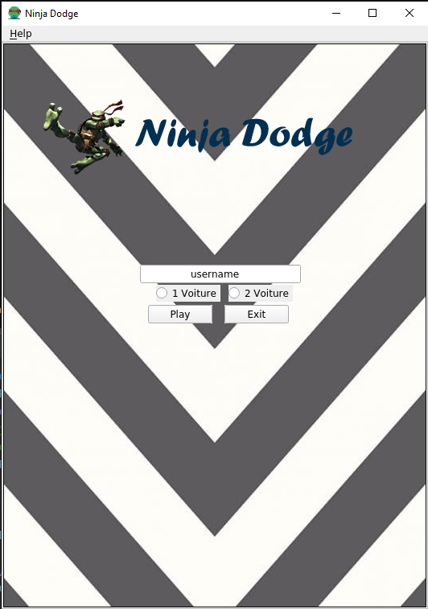
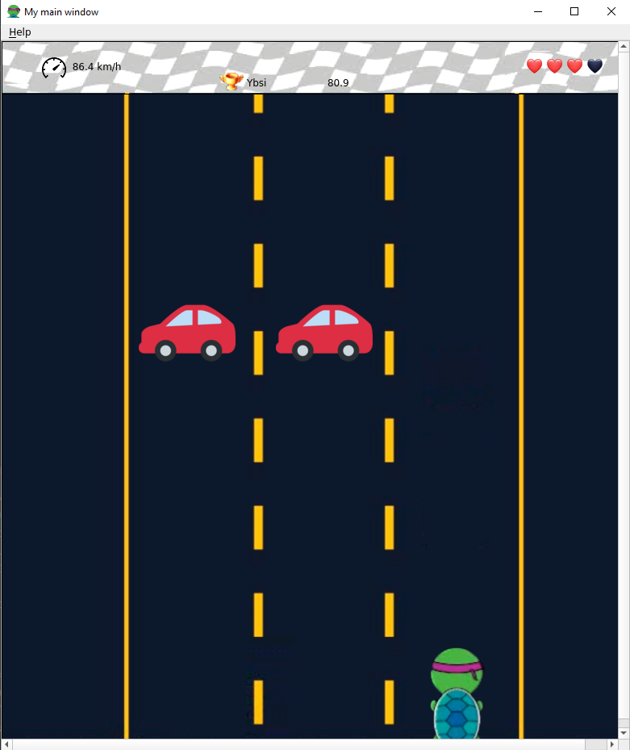

**Ninja Dodge - The Game**
-

**-Comment Jouer ?**
-
Le jeu est actuellement disponible uniquement pour debian.
Afin de le lancer il suffit d'exécuter le fichier *Ninja_Dodge* present dans le dossier release.

**- Liste des dépendances nécessaires a l'exécution du jeu :**
-
- QT5
- QT::Widgets

**- Règles du jeu**
-
Le but du jeu est simple : Vous etes une tortue et vous voulez marcher tranquillement sur la route.
Malheureusement il y a du passage et vous devez esquiver les voitures afin d'éviter de finir en coquille cassé.

Afin de faire bouger votre personnage vous allez pouvoir utiliser les flèches gauche ⬅️ et droite ➡️ de votre ordinateur.
Vous pouvez mettre le jeu sur pause en utilisant la touche *Echap*

Vous pouvez choisir entre 2 modes de jeu : le mode facile, il n'y a qu'une voiture a la fois qui passe et le mode difficile : il peut y avoir 1 ou 2 voitures qui passent en même temps.

Peu importe le mode de jeu vous aurez en tout 4 vies ❤️, une fois ces 4 vies utilisées vous aurez perdu.

Votre score est calculé sous la forme de km/h 🚓. Plus vous avancerez dans le jeu et plus les voitures iront vite, saurez vous battre le champion en titre actuel ? 🥇

Voilà, vous connaissez désormais les règles de ce jeu, bonne chance à vous jeune tortue !

Le menu d'accueil :

L'affichage du jeu :

